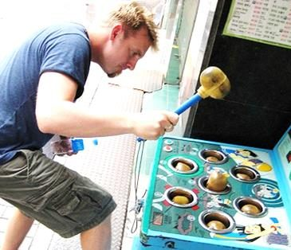
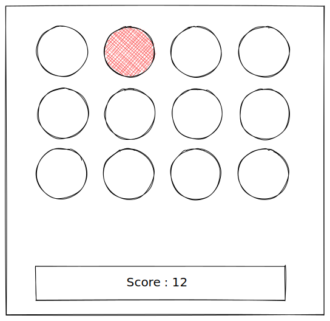

# Timeouts and intervals

What if you want to execute a function in the future?

## Theory

### The `setTimeout()` function

The [setTimeout](https://developer.mozilla.org/en-US/docs/Web/API/WindowOrWorkerGlobalScope/setTimeout) function allows you to execute a function in the future. This function takes two arguments:

- The function to execute
- The time, in milliseconds (thousandths of a second), the timer should wait before the specified function or code is executed.

#### Simple example

Let's start with a basic example, you can try this directly in the console.

```javascript
console.log("WARNING! In exactly five seconds something will explode");

function theExplosion() {
  console.log("BOOM!");
}

setTimeout(theExplosion, 5000);
```

You can also combine timeout and events, the only limit is your imagination.

```javascript
function theExplosion() {
  alert("BOOM!");
}

const button = document.createElement("button");
button.textContent = "WARNING";
button.addEventListener("click", () => {
  // this will delay the event by 5 seconds
  setTimeout(theExplosion, 5000);
});
document.body.appendChild(button);
```

#### Recursion

You can use [recursion](https://en.wikipedia.org/wiki/Recursion) (a function that calls itself) to create repetitive delays.

```javascript
let times = 0;
function heyYou() {
  console.log("Hey! You! I called you " + times + " times!");
  times++;

  const nextCall = Math.floor(Math.random() * 2000); // Random delay until heyYou() is called again
  setTimeout(heyYou, nextCall);
}
```

### The `setInterval()` function

The [setInterval](https://developer.mozilla.org/en-US/docs/Web/API/WindowOrWorkerGlobalScope/setInterval) is another way to call a function multiple times. It works exactly like `setTimeout` except, the function is called repetitively.

#### Simple example

The previous "hey you" example can be rewritten like this:

```javascript
let times = 0;
function heyYou() {
  console.log("Hey! You! I called you " + times + " times!");
  times++;
}

setInterval(heyYou, 1000);
```

### Clearing timers

You can cancel any previously set interval or timeout, using `clearTimeout` or `clearInterval`.

```javascript
let interval;
let times = 0;

function heyYou() {
  console.log("Hey! You! I called you " + times + " times!");
  times++;
}
```
## Exercises

### Exercise 1

Write a function that mimics the behaviour of a typewriter.

Using `setInterval` display the word `Wozniak` one character at a time (one letter per second). Once the word is written on the screen clear the interval.

### Exercise 2

Write a function that displays every second that has passed on the page since it was opened. The display should be refreshed every second. If 60 seconds are elapsed, write "a minute has passed", then "2 minutes have passed" (for 120 seconds and more), etc.

### Exercise 3 - Whack-A-Mole (bonus)



Let's create a simple [Whack-A-Mole](https://en.wikipedia.org/wiki/Whac-A-Mole) clone.

The goal of this traditional game is to prevent "moles" from coming out the ground with a hammer. Every second a new "mole" appears and you'll have to click on it to gently tell her to go back into the soil where it belongs. The game doesn't have to picture moles, or animal cruelty you can simply display circle `<div>`s to begin with. Everytime you click on a mole, your score increases.

If you'd like to spice things up, you can create an increasing difficulty by reducing the timeframe in which the mole appears.

Here is a badly drawn example to get you started. Let's do this!



## If you want to go further ...

Timeouts and Intervals are key elements when building game. You want to

- Create a game where enemies move all the time (ex: PacMan, Snake, FlappyBird)
- Create a game that involves trajectories and bullets (ex: Pong, Space Invaders)
- Create games that involve timers (ex: Bomberman, Timed chess)

You now have every tool you need to build those games, or create a concept of your own.