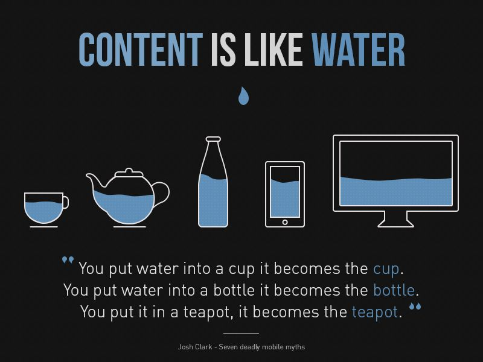

# Responsive Web Design

- Repository name: `responsiveness`
- Mode: `solo`
- Type of Challenge: `exercise`
- Duration: `½ day`
- Deployment strategy:`Github pages`

## The Problem

**Multiplicity of Screens**  
Today, the same content can be seen on different sized devices; a TV, a laptop, a watch, a smartphone. You can imagine the content should adapt for each device. So how? A code-base for each platform? Duplicating the code for each version of the same website?

The problem came to be in 2007 with the surge of the first Iphones, from then on it's been a rush of new sizes. The industry needed time to adapt and find a new standard. In 2010, the web designer [Ethan Marcotte](https://twitter.com/beep) introduced the term "Responsive Web Design" or (RWA) for this on [A List Apart](http://alistapart.com/article/responsive-web-design).

## The solution : CSS Media Queries

With Media Queries, we can tell the navigator : if the size of the screen is X, use these css properties, otherwise those.
The expected UX result is something like this :

Responsive web design has led to a new way of looking at a site, increasingly differentiating between substance (content) and appearance (the container: the device).

## Examples of media queries usage 

## Good to know: Box-Sizing

In **CSS** is the `box-sizing` property fascinating to know about. 
Box sizing allows you to include the margins and paddings of an element inside that element's width and height.

E.g.: Let's say you have a div with a width of 200px and height of 100px,
and you add a padding of 50px to that element in your css.

Then the size of your div will be the 200x100 + 50 on each side.

With the box sizing set as `border-box`, you will ensure that your padding will stay inside the 200x100.

> Keep this in mind during the following exercise!

## Your turn

1. Learn about `CSS media queries`
2. Complete these few exercises to get a good sense of them
3. DO NOT use any CSS framework

> You can ignore previous requirements if these contradict instructions later on

### 1. Change the color

Create an HTML file and a CSS file.
Make the background color of the body **red** when the width of the viewport is smaller than 480px, **green** when the viewport width is bigger than (or equal to) 480px and smaller than 1024px, and **blue** when the viewport is bigger than (or equal to) 1024px.

If you want prettier colors, try https://colorhunt.co/ for inspiration.

💡 `480` and `1024` are also called **breakpoints**. They are typically used as threshold between _cell phone_, _tablet_, and _computer_.

### 2. Display / hide elements

Add three `div`: one div with the id="small", one div with the id="medium", another div with the id="large". In each element add the word small, medium and large respectively as content for display purposes.

Make it so only one div is displayed, according to the width of the current viewport.

### 3. Adapt the size of the text according to the device

In each div, add a title and a few paragraphs (lorem ipsum, and such). Give the title a descriptive text (for example: "Content for smartphones")
Change the font size according to the device type.

### 4. Re-Arrange

Make it so that :

- if small, the 3 divs are stacked on top of one and other.
- if medium, the first div takes 2/3 of width, the second 1/3 of width and the third the full width.
- if big, the 3 divs should be next to one another.

### 5. Continue

Make sure every future assignment is responsive!  
Most CSS frameworks do this for you, but we will see them in the future :)

## Done? Congratulations, have your content behave!

